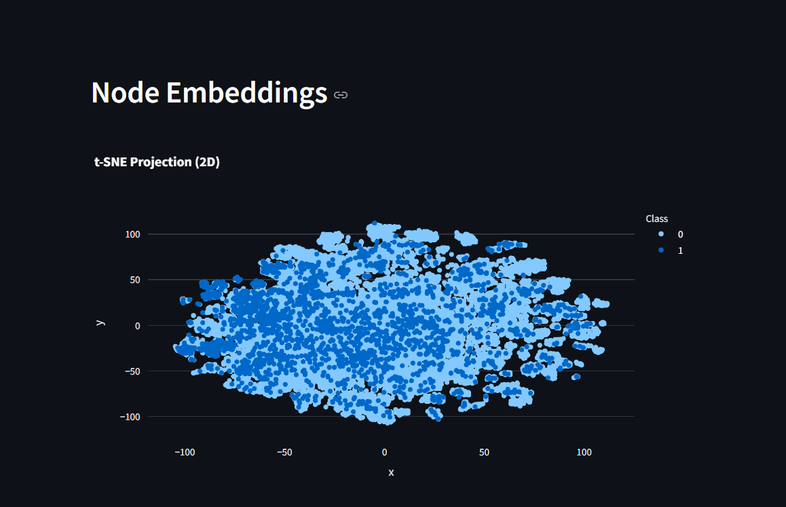
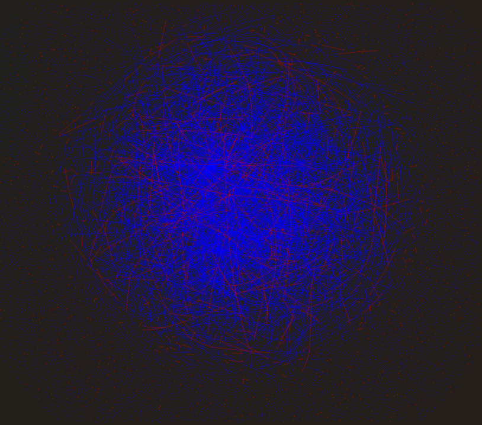

# Fraud Detection in Blockchain Transactions Using Graph Neural Networks

## Overview
This project explores the use of **Graph Neural Networks (GNNs)** for detecting illicit transactions in blockchain networks. Using the publicly available **Elliptic Bitcoin Transaction Dataset**, we implemented and compared two state-of-the-art GNN architectures: **Graph Convolutional Networks (GCN)** and **Graph Attention Networks (GAT)**. The goal is to classify transactions as either *licit* or *illicit* while leveraging the graph structure of blockchain transactions.

This project is inspired by the paper ["Graph Network Models To Detect Illicit Transactions In Blockchain"](https://arxiv.org/html/2410.07150v1), which highlights the potential of graph-based models in combating financial crimes.

---

## Dataset
The **Elliptic Bitcoin Transaction Dataset** contains:
- **Nodes:** Represent Bitcoin transactions.
- **Edges:** Represent directed flows of Bitcoin between transactions.
- **Features:** Each node has 166 features describing transaction metadata.
- **Labels:** Transactions are labeled as:
  - `1` (illicit): Associated with illegal activities such as money laundering.
  - `0` (licit): Legitimate transactions.

---

## Methodology
We implemented two GNN architectures for this task:
1. **Graph Convolutional Networks (GCN):**
   - Captures local neighborhood information using graph convolutions.
   - Suitable for learning from graph-structured data.

2. **Graph Attention Networks (GAT):**
   - Uses attention mechanisms to assign importance to neighboring nodes.
   - Handles noisy and heterogeneous graphs more effectively than GCN.

### Experimental Setup
- **Training/Validation/Test Split:**
  - 60% training, 20% validation, 20% test.
- **Evaluation Metrics:**
  - F1 score, accuracy, confusion matrix, ROC-AUC.

---

## Results
### Comparison of GCN vs. GAT
| Metric      | GCN    | GAT    |
|-------------|--------|--------|
| Test F1     | `0.632`| `0.671`|
| Test Accuracy | `85.3%` | `87.2%` |
| ROC-AUC     | `0.891`| `0.912`|

### Visualizations

#### 2. t-SNE Visualization of Node Embeddings

#### 3. Graph Structure Visualization

---

## Instructions

### Prerequisites
Ensure you have Python installed along with the required libraries:
